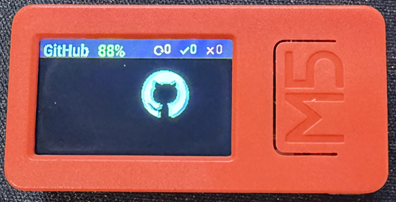

# GitHub Monitor Gizmo

[][esphome]
[][ha-esphome]
[][m5]
[-blue)][m5s3]
[](https://github.com/features/copilot)
[](LICENSE)

An [ESPHome][esphome] firmware for the [M5StickC Plus 1.1][m5] and
[M5Stick S3 (K150)][m5s3] that turns them into a desk-top GitHub
activity monitor. It polls your user events feed, carousels through
anything new, beeps on CI failures (Plus 1.1 only), bounces a Material
Design GitHub logo around the screen when idle, and shows battery % on
the Plus 1.1.

> The Plus 1.1 and S3 share a 135×240 ST7789 panel so the entire UI
> layer is identical between them. The S3 build has no audio (it uses
> an I2S codec rather than a passive buzzer; audio support is deferred)
> and currently does not publish a battery-level sensor.



## Features

- **Events carousel** – shows each new event since the last poll in
  turn, one card every 5 s, with a bottom-of-screen progress dot row.
  Press the front M5 button to dismiss and return to idle.
- **Per-event detail** – headline (e.g. `Deleted branch`, `PR`,
  `CI FAIL`) plus a second line with branch/ref or PR/issue number and
  repo name.
- **CI tally** – running / success / failed counts across the last
  page, right-aligned in the header with Material Design icons.
- **Copilot detection** – highlights events where the actor, PR
  author, requested reviewer, commenter, or workflow triggering actor
  contains "copilot" (case-insensitive).
- **Audio cues** (Plus 1.1 only) – short "ping" on new events, distinct
  "fail" tune on a CI failure. On the S3 these three scripts are no-ops.
- **Idle DVD-bouncer** – the GitHub logo bounces around the screen
  and cycles colour on each wall hit.
- **Copilot usage card** – every 10 minutes the gizmo pulls your
  current-billing-cycle Copilot usage from GitHub. Requires a token
  with billing read access (see
  [`secrets.yaml.example`](secrets.yaml.example)).
- **Contributions card** – commits and PRs for today, this week and
  this year, via a single GraphQL query against the authenticated
  `viewer`'s `contributionsCollection`. Private + org repos the token
  can see are included regardless of your profile's "Include private
  contributions" toggle.
- **Pull-request card** – PRs you have open, merged this week, and
  review-requested on you, from GitHub search.
- **CI donut** – running / success / failed workflow runs on the
  recent events page, as a coloured ring with legend.
- **API rate-limit card** – remaining hourly budget on the REST core
  bucket, plus the Copilot bucket when the account exposes it.
- **Activity card** – current contribution streak (consecutive days)
  and the best day this week, derived from your contribution calendar.
- **Issues card** – open issues assigned to you, open issues you've
  authored, and issues you've closed this week.
- **Contribution heatmap** – last ~5 weeks of daily contributions as
  a GitHub-style 7×6 green grid.
- **14-day sparkline** – a tiny line graph of daily commit counts for
  the last fortnight, with total and peak day.
- **Dependabot card** – open vulnerability alerts across all repos
  the token can see, plus the repo with the most open alerts. Updates
  every 15 minutes.
- **Idle card flash** – while idle (no new events), the DVD bouncer
  runs and once a minute the next enabled card above is flashed on
  screen for ~10 s before returning to the bouncer. Live events always
  preempt the flash cycle.
- **Night mode** – the backlight switches off between configurable
  hours (default 20:00–08:00 local) to stop it lighting up a bedroom.
  Press the front M5 button to wake the screen for 15 s, and incoming
  events wake it for the duration of the carousel.
- **Graceful degradation** – any card whose permission is missing is
  silently disabled the first time it gets a 401/403/404 and stays
  off until reboot; nothing is retried or log-spammed.
- **Battery %** (Plus 1.1 only) – read from the on-board AXP192 PMIC
  over I²C and exposed to Home Assistant as a sensor. On the S3 the
  sensor exists but publishes `NaN` until a M5PM1 battery register is
  wired up.

## Hardware

Choose one:

- [M5StickC Plus 1.1][m5] (ESP32-PICO, 135×240 ST7789V, AXP192,
  buzzer, front "M5" button, side button, IR, mic)
- [M5Stick S3 (K150)][m5s3] (ESP32-S3-PICO-1-N8R8, 135×240 ST7789P3,
  M5PM1 PMIC, ES8311 I2S codec + AW8737 amp, BMI270 IMU, KEY1 + KEY2
  buttons)
- USB-C cable for the initial flash and power

> **⚠ Display longevity warning — Plus 1.1 owners read this.**
>
> Both boards use a small ST7789 IPS LCD, but their backlights behave
> very differently:
>
> - **M5StickC Plus 1.1** – the backlight LED string is driven by
>   the [AXP192 PMIC][axp192-doc]'s LDO2 rail at a **fixed voltage with
>   no PWM**. While the display is on, the LEDs run at 100% drive
>   current, constantly. In 24/7 use this *will* shorten the
>   backlight's life: at least one user of this firmware has already
>   had the backlight die outright (screen content still rendered, but
>   no illumination). In addition, the 120 mAh Li-ion cell is
>   continuously trickle-charged while USB is plugged, which over
>   months is known to cause cell swelling and can physically stress
>   the display.
> - **M5Stick S3 (K150)** – the backlight is PWM-dimmable on GPIO38
>   (default `backlight_brightness: "0.6"`), which reduces effective
>   LED current and heat. It also ships with a larger 250 mAh cell.
>
> **You cannot firmware-dim the Plus 1.1's backlight.** The only
> defences that exist are time-based. The firmware already ships
> them on by default – leave them on:
>
> - Night-mode hours (`sleep_start_hour` / `sleep_end_hour`, default
>   20:00 → 08:00) blank the screen overnight.
> - Idle-UI auto-sleep (`idle_screen_off_cycles`, default `1`) turns
>   the backlight off after one carousel rotation when there's nothing
>   new to show.
>
> For Plus 1.1 24/7 deployments specifically, consider widening the
> night-mode window (e.g. `20` → `9`) and leaving
> `idle_screen_off_cycles: "1"`. See
> [Screen protection](#configuration-notes) below for the full
> tuning guide. Treat the Plus 1.1 display as a consumable with a
> finite lifetime; the S3 is the better long-term choice.

## Prerequisites

- [ESPHome][esphome] 2026.4 or later – pick the toolchain that
  matches your chosen install path:
  - [ESPHome Builder add-on][ha-addon] inside Home Assistant, or
  - [ESPHome CLI][esphome-install] locally, or
  - [web.esphome.io][espweb-flash] (browser-only, Chrome/Edge).
- A GitHub personal access token – see
  [Creating a GitHub token](#creating-a-github-token)
- A 2.4 GHz Wi-Fi network the device can reach

## Installation

### 1. Choose your variant and download the firmware

The firmware ships in two flavours per hardware:

- **Home Assistant variant** – enables the ESPHome [native API][espapi]
  so the gizmo appears as a device in HA with entities for battery %
  (and on the S3, charging + USB voltage). Recommended if you already
  run HA.
- **Standalone variant** – no HA integration. Instead the firmware
  exposes ESPHome's built-in [web UI][espweb] on port 80 and falls
  back to a [captive portal][espcp] for first-boot Wi-Fi. Use this if
  you don't run HA or want to flash from a browser only.

Download the matching YAML from the latest [GitHub Release][releases]:

|                       | Home Assistant (native API)              | Standalone (built-in web UI)                    |
|-----------------------|------------------------------------------|-------------------------------------------------|
| **M5StickC Plus 1.1** | `ghmonitorgizmo-cplus-ha.yaml`           | `ghmonitorgizmo-cplus-standalone.yaml`          |
| **M5Stick S3 (K150)** | `ghmonitorgizmo-s3-ha.yaml`              | `ghmonitorgizmo-s3-standalone.yaml`             |

### 2. Create a GitHub token

See [Creating a GitHub token](#creating-a-github-token) below. Keep
the value to hand – you'll paste it into `secrets.yaml` in the next
step.

### 3. Prepare `secrets.yaml`

All three install paths read the same ESPHome `secrets.yaml`
([ESPHome secrets docs][espsecrets]). Start from
[`secrets.yaml.example`](secrets.yaml.example) and fill in Wi-Fi,
GitHub user + token, and the ESPHome device secrets. If you only
plan to flash the standalone variant you can omit
`ghgizmo_api_encryption_key`. See the [secrets.yaml](#secretsyaml)
section below for the full field list.

### 4. Install the USB-serial driver (first flash only)

The first flash goes over USB. After that, OTA updates run over
Wi-Fi and no driver is required.

| Device            | Bridge chip             | Driver                                                                                                 |
|-------------------|-------------------------|--------------------------------------------------------------------------------------------------------|
| M5StickC Plus 1.1 | FTDI (FT231X)           | **Windows / macOS:** [FTDI VCP driver][ftdi-vcp]. **Linux:** already in-kernel (`ftdi_sio`).            |
| M5Stick S3 (K150) | *native USB (ESP32-S3)* | No driver required on any platform – the chip presents itself as a standard USB-CDC serial device.     |

Device-specific vendor pages (useful if the port still doesn't
enumerate – they cover download-mode button combos and download-rate
caveats):

- M5StickC Plus 1.1: <https://docs.m5stack.com/en/core/m5stickc_plus>
  ([Arduino quick start](https://docs.m5stack.com/en/arduino/m5stickc_plus/program))
- M5Stick S3 (K150): <https://docs.m5stack.com/en/core/StickS3>
  ([Arduino quick start](https://docs.m5stack.com/en/arduino/m5sticks3/program))

After install, unplug and replug the stick and confirm a new serial
port appears: `COM<n>` in Windows Device Manager, or
`/dev/tty.usbserial-*` / `/dev/tty.usbmodem*` on macOS/Linux.

### 5. Flash – follow the guide for your install path

With the firmware downloaded, the token ready, `secrets.yaml`
populated, and the driver installed, pick the guide for your
toolchain:

- **Home Assistant** – [docs/INSTALL-ha.md](docs/INSTALL-ha.md) – use
  the [ESPHome Builder add-on][ha-addon] to flash over USB and then
  OTA-update.
- **Standalone (browser)** –
  [docs/INSTALL-standalone-web.md](docs/INSTALL-standalone-web.md) –
  flash from Chrome/Edge with [web.esphome.io][espweb-flash]; no
  local toolchain required beyond a one-off compile.
- **Standalone (CLI)** –
  [docs/INSTALL-standalone-cli.md](docs/INSTALL-standalone-cli.md) –
  the classic [`esphome run`][espcli-guide] flow.

## Creating a GitHub token

The device always polls `GET /users/{user}/events` for the events
carousel. Optional extra cards each want their own fine-grained
permission; anything the token can't read is silently disabled the
first time it fails, so you can start with the minimum and add later.

| Card                                 | Fine-grained permission              | Classic scope            |
|--------------------------------------|--------------------------------------|--------------------------|
| Events carousel + CI tally + donut   | Metadata: Read-only (default)        | (public) or `repo`       |
| Private-repo events                  | Contents: Read-only                  | `repo`                   |
| Copilot usage (billing)              | Plan: Read-only                      | `manage_billing:copilot` |
| Contributions, PRs, Issues, Activity, Heatmap, Sparkline | Contents: Read-only + Pull requests: Read-only + Issues: Read-only | `repo`, `read:user`, `read:org` |
| API rate-limit card                  | (any token)                          | (any)                    |
| Dependabot alerts                    | Dependabot alerts: Read-only         | `security_events`        |

The firmware uses the GraphQL `viewer` field, so private and org
contributions are counted automatically if the token can see those
repos — the old "Include private contributions on my profile" toggle
is **not** required.

For **org repos**, a **classic PAT** is the most reliable route:
generate one with `repo`, `read:org`, `read:user`, and (if you want
the Dependabot card) `security_events`. On the token's settings page,
click **Authorize SSO** next to each org that uses SAML.

A **fine-grained PAT** also works but must have each org and each
repo granted explicitly, with the permissions above.

> **Copilot co-authored commits** only count toward your contributions
> when the commit's primary `author` is you. A `Co-authored-by:` trailer
> alone does not make it one of yours — that's a GitHub rule, nothing
> the firmware can change.

Create a token at <https://github.com/settings/tokens>. Put it in
`secrets.yaml` as `ghgizmo_github_token`. It's sent over HTTPS only to
`api.github.com`.

## secrets.yaml

All secrets live in an ESPHome `secrets.yaml`. With the HA add-on this
is shared across every ESPHome device at `/config/esphome/secrets.yaml`
– Wi-Fi credentials are typically already there. You only need to add
the `ghgizmo_*` entries:

| Key | Purpose |
|-----|---------|
| `wifi_ssid` / `wifi_password` | Shared Wi-Fi (not prefixed; re-used across devices) |
| `ghgizmo_github_user` | Your GitHub username |
| `ghgizmo_github_token` | Personal access token |
| `ghgizmo_api_encryption_key` | ESPHome ↔ Home Assistant encryption key (HA variant only; ignored by standalone) |
| `ghgizmo_ota_password` | OTA update password |
| `ghgizmo_ap_password` | Fallback AP password (also the captive-portal password for the standalone variant) |

See [`secrets.yaml.example`](secrets.yaml.example) for the template.

## Configuration notes

- The firmware sets `verify_ssl: false` because mbedTLS on ESP-IDF
  doesn't ship the GitHub CA chain by default. All GitHub traffic
  still goes over TLS; only chain verification is skipped.
- **Wi-Fi**: the device is a 2.4 GHz-only ESP32. It needs an SSID
  that's broadcast on 2.4 GHz (if your router advertises the same
  SSID on both bands, that's fine), with WPA2-Personal or
  WPA2/WPA3-mixed. WPA3-only and Enterprise (802.1X) networks are
  **not** supported. Credentials come from the shared ESPHome
  `wifi_ssid` / `wifi_password` in `secrets.yaml`. If the primary
  network is unreachable at boot, the device brings up a fallback
  access point with the SSID `GH Monitor Gizmo` and the password
  from `ghgizmo_ap_password` – connect to it and browse to
  `http://192.168.4.1` to reconfigure.
- Static IP is set via the `static_ip` / `gateway` / `subnet` / `dns1`
  / `dns2` **substitutions** at the top of the installed YAML.
  Adjust them to match your network, or delete the `manual_ip:` block
  under `wifi:` entirely to use DHCP instead.
- **Night mode** is controlled by the `sleep_start_hour`,
  `sleep_end_hour` and `timezone` substitutions at the top of the
  installed YAML. Hours are 0–23 in the given IANA timezone
  (e.g. `Europe/London`, `America/New_York`). The window may wrap
  midnight (e.g. `20` → `8`). Set `sleep_start_hour` equal to
  `sleep_end_hour` to disable night mode entirely.
- Poll interval for the events feed is 60 s with a 30 s startup delay,
  matching the GitHub events endpoint's ~60 s server-side cache. The
  Copilot usage, Contributions/PR/Issues stats, and rate-limit probe
  run every 10 min; Dependabot alerts every 15 min. Tune via the
  `interval:` blocks; mind the 5000 req/hr user rate limit.
- Memory tuning lives in `esp32.framework.sdkconfig_options`. Do **not**
  add `bluetooth_proxy:` – the ESP-IDF HTTP client needs a contiguous
  allocation that a running BLE stack tends to fragment out of
  existence.
- **Screen protection** – small ST7789 panels have two distinct
  failure modes in 24/7 use:
  1. **Backlight LED burnout** – tiny edge-lit LEDs driven at full
     current continuously (notably on the Plus 1.1, where the AXP192
     LDO2 rail has no PWM) eventually short or open and the display
     goes dark while the rest of the board still works. This has
     happened in the field on this firmware.
  2. **Image retention** – localised colour shift where static
     elements (e.g. the header bar) sit for weeks.
  Both firmwares expose a `backlight_brightness` substitution
  (0.0–1.0); **only the S3 honours it** (real PWM on GPIO38). The
  Plus 1.1 backlight is switched on/off by the AXP192 LDO2 rail and
  cannot be dimmed, so on that device `backlight_brightness` is
  ignored and the only defences are time-based: night-mode hours
  (`sleep_start_hour` / `sleep_end_hour`) plus the idle-UI
  auto-sleep (`idle_screen_off_cycles`, default `1`). For a 24/7
  deployment on the Plus 1.1 consider widening the night-mode
  window (e.g. `20` → `9`). On the S3 the default brightness is
  `0.6` and lowering it further (e.g. `0.35`) is the single most
  effective way to extend backlight life.
- **Idle-UI auto-sleep** – after `idle_screen_off_cycles` complete
  rotations of every available info card, the backlight is turned off,
  the DVD-bouncer animation is paused, and all background polling
  except the 60 s events fetch stops. A new event wakes the screen via
  the usual events window; pressing Button A seeds another set of
  cycles. Card and bouncer dwell times are tunable via
  `idle_card_seconds` (default `10`) and `idle_bouncer_seconds`
  (default `10`). Set `idle_screen_off_cycles: "0"` to disable and
  keep the old always-on behaviour.

## Controls

| Input | Plus 1.1 | Stick S3 | Action |
|-------|----------|----------|--------|
| Front button | M5 (GPIO37) | KEY1 (GPIO11) | Dismiss current event card → return to idle |
| Side button | GPIO39 | KEY2 (GPIO12) | Unused (wire up in `binary_sensor:` if you want) |
| Reset | left side | side | Hardware reset |

## Screen layout

```
 ┌──────────────────────────────────────┐
 │ GitHub   87%        [↻3 ✓5 ✗1]       │  ← header
 │                                      │
 │          Deleted branch              │  ← headline (colour-coded)
 │        copilot/fix-7  oura-mcp       │  ← detail (branch + repo)
 │                                      │
 │                                      │
 │ A: dismiss        • • ● • •          │  ← hint + carousel dots
 └──────────────────────────────────────┘
```

## Troubleshooting

- **`HTTP_CLIENT: Allocation failed`** – heap fragmentation. Reduce
  `buffer_size_rx` and `max_response_buffer_size` in `http_request:`,
  or reduce `per_page=` in the URL.
- **`user json parse failed: IncompleteInput`** – `max_response_buffer_size`
  is smaller than the response body. Raise it (currently 12 288).
- **`interval took a long time (>1 s)`** – usually the JSON parse on
  the 8 KB response. Harmless log noise.
- **Nothing shown after boot** – the device waits 30 s for Wi-Fi, then
  polls. On first fetch only the top event is shown as proof of life;
  after that, only genuinely new events trigger a carousel.
- **Contribution counts look too low** – check the token has access to
  the private/org repos you contribute to (see above). Classic PATs
  with SSO authorised per org are the most reliable.
- **Dependabot card never appears** – the token is missing
  `security_events` / `Dependabot alerts: Read-only`, or the account
  has no alerts to show. The card is silently disabled on the first
  401/403/404 and won't retry until reboot.
- **Battery reads 100 % with USB plugged** – that's the AXP192's raw
  voltage crossing the upper bound of the 3.3–4.2 V mapping.

## Development

The firmware is maintained as a set of source templates so common
logic (fetch scripts, display lambda, globals, intervals) is shared
across hardware variants, and the installable artefact is a single
self-contained YAML per device.

```
gh-gizmo/
├── common/                # shared YAML fragments
│   ├── network.yaml       # logger / ota / wifi / http_request / time
│   ├── fonts.yaml
│   ├── globals.yaml
│   ├── intervals.yaml
│   ├── scripts.yaml       # GitHub fetch scripts (user events, copilot, stats, ...)
│   ├── display_lambda.yaml
│   └── variants/
│       ├── ha/api.yaml          # HA variant: native ESPHome API
│       └── standalone/api.yaml  # standalone variant: web_server + captive_portal
├── m5stickcplus/
│   └── ghmonitorgizmo.yaml.src      # M5StickC Plus 1.1 source template
├── m5sticks3/
│   └── ghmonitorgizmo-s3.yaml.src   # M5Stick S3 (K150) source template
├── docs/                  # install guides, one per methodology
│   ├── INSTALL-ha.md
│   ├── INSTALL-standalone-web.md
│   └── INSTALL-standalone-cli.md
├── dist/                  # build output (gitignored)
│   ├── ghmonitorgizmo-cplus-ha.yaml
│   ├── ghmonitorgizmo-cplus-standalone.yaml
│   ├── ghmonitorgizmo-s3-ha.yaml
│   └── ghmonitorgizmo-s3-standalone.yaml
├── build.py               # inlines `# !include` + `# !include_variant` into dist/
└── .github/workflows/build.yml   # CI: builds on push, releases on tag
```

`build.py` reads each device's `.yaml.src` template and replaces
`# !include <path>` lines with the verbatim contents of the referenced
fragment. `# !include_variant <name>` resolves to
`common/variants/<variant>/<name>` where `<variant>` is `ha` or
`standalone`, producing four single-file YAMLs that Home Assistant's
ESPHome Builder add-on, the ESPHome CLI, or [web.esphome.io][espweb-flash]
can install directly (no `packages:` / `!include` support required on
the install side).

```powershell
# build every device-variant (four outputs)
python build.py

# build a single source to a custom output
python build.py m5stickcplus/ghmonitorgizmo.yaml.src --variant standalone -o dist/foo.yaml
```

The GitHub Actions workflow runs `build.py` on every push, verifies
idempotency (running twice produces identical output), and on tagged
releases (`v*`) attaches the built YAMLs as downloadable release
assets.

For editing the YAML locally, the
[ESPHome VS Code extension][vscode-ext] is very useful – it gives you
schema validation, autocomplete, and inline docs for every component.

## Further reading

- [ESPHome documentation][esphome]
- [Home Assistant ESPHome integration][ha-esphome]
- [ESPHome Builder add-on (HA)][ha-addon]
- [M5StickC Plus 1.1 hardware docs][m5]
- [M5Stick S3 hardware docs][m5s3]
- [GitHub Events API][gh-events]

## Licence

[MIT](LICENSE)

[m5]: https://docs.m5stack.com/en/core/m5stickc_plus
[m5s3]: https://docs.m5stack.com/en/core/StickS3
[releases]: https://github.com/gjlumsden/gh-monitor-gizmo/releases/latest
[esphome]: https://esphome.io/
[esphome-install]: https://esphome.io/guides/installing_esphome
[espapi]: https://esphome.io/components/api
[espweb]: https://esphome.io/components/web_server
[espcp]: https://esphome.io/components/captive_portal
[espweb-flash]: https://web.esphome.io/
[espcli-guide]: https://esphome.io/guides/getting_started_command_line
[ftdi-vcp]: https://ftdichip.com/drivers/vcp-drivers/
[axp192-doc]: https://docs.m5stack.com/en/arduino/m5stickc_plus/power
[ha-addon]: https://my.home-assistant.io/redirect/supervisor_addon/?addon=5c53de3b_esphome
[ha-esphome]: https://www.home-assistant.io/integrations/esphome/
[ha-fileeditor]: https://my.home-assistant.io/redirect/supervisor_addon/?addon=core_configurator
[ha-samba]: https://my.home-assistant.io/redirect/supervisor_addon/?addon=core_samba
[ha-vscode]: https://my.home-assistant.io/redirect/supervisor_addon/?addon=a0d7b954_vscode
[gh-events]: https://docs.github.com/en/rest/activity/events
[vscode-ext]: https://marketplace.visualstudio.com/items?itemName=ESPHome.esphome-vscode
